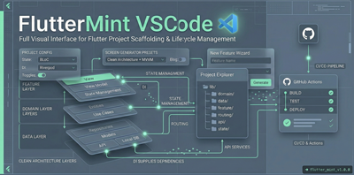
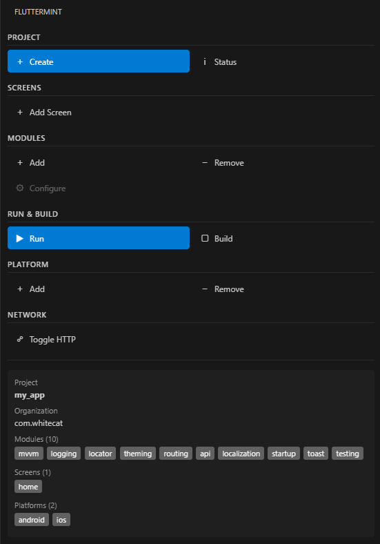
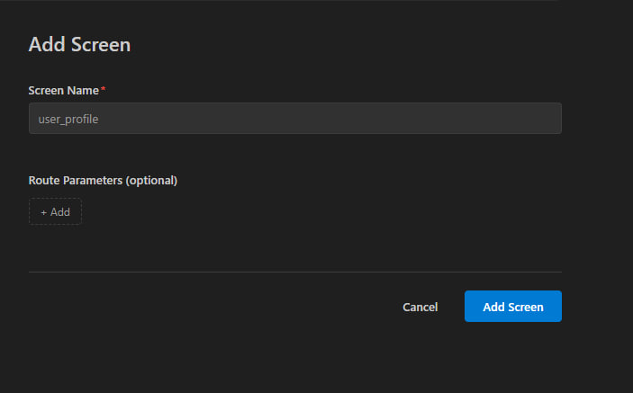
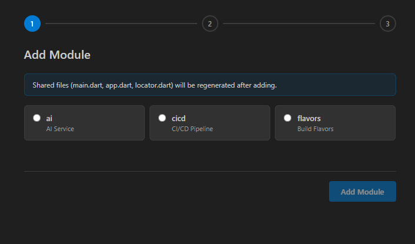
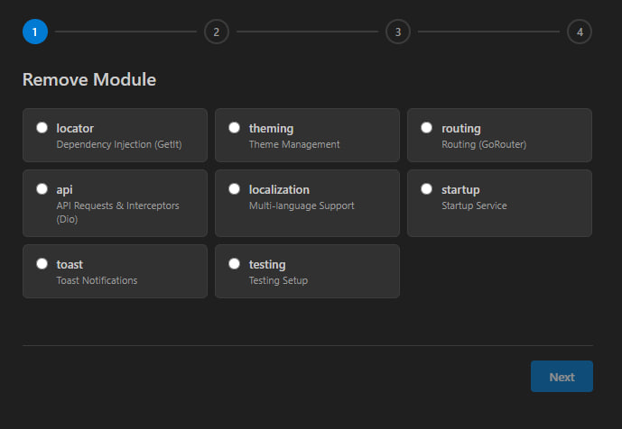
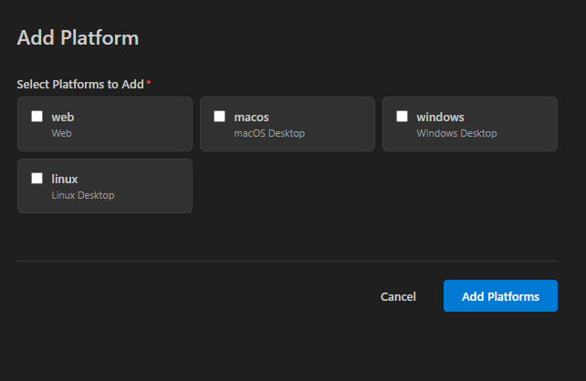
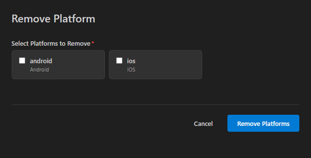

# FlutterMint VSCode



A VS Code extension that gives you a full visual interface for scaffolding, managing, and building Flutter projects using clean MVVM architecture.

FlutterMint wraps the [FlutterMint CLI](https://pub.dev/packages/fluttermint) and replaces every terminal prompt with dedicated in-editor wizard panels, so you never have to leave VS Code.

## Screenshots

| Sidebar & Project Info | Add Screen | Add Module |
|:---:|:---:|:---:|
|  |  |  |

| Remove Module | Add Platform | Remove Platform |
|:---:|:---:|:---:|
|  |  |  |

## Features

### Project Scaffolding
Create a new Flutter project with MVVM clean architecture in a guided wizard. Pick your app name, organization, modules, and platforms - the CLI generates the full project structure.

### Module Management
Add, remove, and configure architecture modules through visual panels:

| Module | Description |
|--------|-------------|
| logging | Logging Service |
| locator | Dependency Injection (GetIt) |
| theming | Theme Management |
| routing | Routing (GoRouter) |
| api | API Requests & Interceptors (Dio) |
| ai | AI Service |
| localization | Multi-language Support |
| startup | Startup Service |
| toast | Toast Notifications |
| testing | Testing Setup |
| cicd | CI/CD Pipeline (GitHub Actions) |
| flavors | Build Flavors / Environments |

Modules with dependencies are resolved automatically - adding `ai` will also add `api`, removing `api` will also remove `ai`, etc.

Configurable modules (`cicd` and `flavors`) open a dedicated configuration wizard after installation.

### Screen Generator
Add new screens with typed route parameters. The CLI generates the view, viewmodel, and routing boilerplate.

### Platform Management
Add or remove target platforms (Android, iOS, Web, macOS, Windows, Linux) through a checkbox wizard.

### HTTP Toggle
Enable or disable cleartext HTTP connections for Android and iOS with a single click.

### Status Dashboard
A read-only webview panel showing your project's current state: app name, organization, installed modules, screens, and platforms.

### Sidebar
An activity bar panel with quick-access buttons for every command. Displays a live summary of your project config at the bottom, auto-refreshes when `.fluttermint.yaml` changes.

## Requirements

- **VS Code** 1.85+
- **Dart SDK** (included with Flutter)
- **FlutterMint CLI** - install with:

```bash
dart pub global activate fluttermint
```

## Getting Started

1. Install the FlutterMint CLI: `dart pub global activate fluttermint`
2. Install this extension from the VS Code Marketplace
3. Open the FlutterMint sidebar (f-mint icon in the activity bar)
4. Click **Create** to scaffold a new project, or open an existing FlutterMint project

The extension activates automatically when it detects a `.fluttermint.yaml` file in your workspace.

## Commands

All commands are available from the Command Palette (`Ctrl+Shift+P` / `Cmd+Shift+P`):

| Command | Description |
|---------|-------------|
| `FlutterMint: Create Project` | Scaffold a new Flutter project |
| `FlutterMint: Add Screen` | Generate a new screen with route params |
| `FlutterMint: Add Module` | Add an architecture module |
| `FlutterMint: Remove Module` | Remove an installed module |
| `FlutterMint: Configure Module` | Configure cicd or flavors |
| `FlutterMint: Add Platform` | Enable a target platform |
| `FlutterMint: Remove Platform` | Disable a target platform |
| `FlutterMint: Toggle HTTP` | Enable/disable cleartext HTTP |
| `FlutterMint: Show Status` | Open the project status dashboard |
| `FlutterMint: Run` | Run the Flutter project |
| `FlutterMint: Build` | Build the Flutter project |
| `FlutterMint: Open Visual Editor` | Open the visual architecture editor |

## How It Works

The extension is a visual frontend for the FlutterMint CLI. Every action maps to a CLI command:

- Wizards collect user input through webview panels (no native dialogs, no terminal prompts)
- The collected input is passed to the CLI via terminal commands or stdin piping
- The sidebar and status panel read `.fluttermint.yaml` to reflect the current project state
- A file watcher on `.fluttermint.yaml` auto-refreshes the UI after every CLI operation

## License

GPL-3.0
